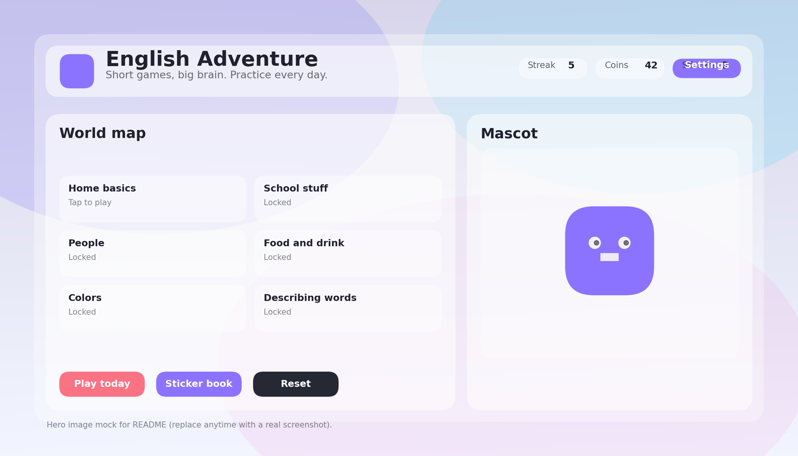

🌍 **Languages:** [English](#english-adventure) · [Italiano](#-versione-italiana)

# English Kiddo 🌈

*A playful English learning website built with love for a curious 7-year-old Italian learner.*

---

## Mission

**English Kiddo** is a small, evolving educational website designed to help a child build a strong foundation in English vocabulary and pronunciation during their formative years.

The goal is simple:
- make learning **fun**
- keep sessions **short and positive**
- focus on **clear pronunciation**
- grow **slowly, at the learner’s pace**

This is not a generic language app.  
It is a personal project that evolves alongside one child’s curiosity, confidence, and abilities.

---

## Target Audience

- Primary: **children aged 6–9**, especially non-native English speakers
- Secondary: parents, relatives, or educators who want a gentle and customizable learning tool

The interface, language, pacing, and rewards are intentionally designed to feel like a game rather than a lesson.

---

## How the Project Evolves

This project is **not finished by design**.

It will grow:
- word by word
- category by category
- sound by sound

New content is added only when the learner is ready.  
Difficulty increases gradually.  
Nothing is rushed.

Think of it as a **digital notebook that comes alive**.

---

## What the Website Does (Today)

- Vocabulary practice using images and words
- Multiple game modes:
  - choose the correct word
  - build the word letter by letter
  - say the word out loud
- Pronunciation support:
  - native English voice models (US / UK)
  - speech recognition feedback (where supported)
- Gentle repetition using spaced review
- Rewards:
  - coins
  - streaks
  - stickers and scenes
- Themes:
  - day / night
  - playful color styles
  - scalable font sizes for young readers
- Parent-only settings and reset gate

All data is stored locally in the browser so the child can safely experiment without accounts or logins.

---

## Technology

This project is intentionally **simple and transparent**.

- **HTML** – structure
- **CSS** – playful, responsive UI with themes and animations
- **JavaScript (ES Modules)** – logic, games, state management
- **Web Speech API**
  - Text-to-Speech for pronunciation
  - Speech Recognition (Chrome, HTTPS)
- **LocalStorage / SessionStorage**
  - progress
  - settings
  - rewards

No frameworks.  
No backend.  
No tracking.  

It runs perfectly on **GitHub Pages** or any static host.

---

## Images & Visual Style

All vocabulary images are:
- whimsical
- clear
- inclusive
- language-neutral (no written words inside images)

Images are generated or curated manually and placed locally in the repository.

This ensures:
- full control over meaning
- no mismatches
- no accidental hints

---

## Roadmap (Living Plan)

Planned areas to introduce over time:

### Vocabulary
- My first 100 words
- Home, school, food, people
- Colors and basic adjectives
- Prepositions with simple scenes

### Pronunciation
- Common Italian → English sound challenges
  - short vs long vowels
  - TH sounds
  - H sound
  - final consonants
- Minimal pairs labs

### Language Building
- Two-word phrases
- Simple sentences
- Question patterns

### Play & Motivation
- Expanded sticker book
- New mascot reactions
- More animated rewards
- Custom scenes

Everything will be introduced **only when appropriate**.

---

## Contributing

This is a personal project, but contributions are welcome.

Ideas for contributions:
- new vocabulary sets
- better kid-friendly animations
- accessibility improvements
- pronunciation tips for young learners
- UI polish for tablets

### How to contribute
1. Fork the repository
2. Create a feature branch
3. Keep changes small and focused
4. Open a Pull Request with a clear description

Please remember:  
**this project prioritizes a child’s experience over technical complexity**.

---

## Acknowledgements

- Inspired by early language learning research and real-world teaching experience
- Built with patience, curiosity, and a lot of testing by a very honest 7-year-old
- Thanks to open web standards for making educational tools accessible to everyone

---

## License

MIT License

Copyright (c) 2026

Permission is hereby granted, free of charge, to any person obtaining a copy of this software and associated documentation files, to deal in the Software without restriction, including without limitation the rights to use, copy, modify, merge, publish, distribute, sublicense, and/or sell copies of the Software.

See the `LICENSE` file for full details.

---

*This project will grow at the speed of one child learning English — and that’s exactly how it should be.*

---

## 🇮🇹 Versione italiana

[English version ↑](#english-adventure)

---

# English Kiddo

*Un sito educativo giocoso per imparare l’inglese, creato con amore per una bambina curiosa.*

---

## Missione

**English Kiddo** è un piccolo progetto educativo pensato per aiutare una bambina italiana a costruire basi solide di inglese durante gli anni formativi.

L’obiettivo è semplice:
- rendere l’apprendimento **divertente**
- mantenere sessioni **brevi e positive**
- concentrarsi sulla **pronuncia corretta**
- crescere **gradualmente, al ritmo della bambina**

Non è un’app generica per lingue.  
È un progetto personale che evolve insieme alla curiosità, alla sicurezza e alle capacità di una sola bambina.

---

## Destinatari

- Principale: **bambini dai 6 ai 9 anni**, in particolare non madrelingua inglese
- Secondario: genitori, zii, educatori che desiderano uno strumento semplice e personalizzabile

L’interfaccia, il linguaggio e il ritmo sono progettati per sembrare **un gioco**, non una lezione.

---

## Un progetto che cresce nel tempo

Questo progetto **non è “finito” per scelta**.

Crescerà:
- parola dopo parola
- categoria dopo categoria
- suono dopo suono

I contenuti vengono aggiunti solo quando la bambina è pronta.  
La difficoltà aumenta lentamente.  
Nessuna fretta.

È come un **quaderno che prende vita**.

---

## Cosa fa il sito (oggi)

- Allenamento del vocabolario con immagini
- Diverse modalità di gioco:
  - scegliere la parola giusta
  - costruire la parola lettera per lettera
  - pronunciare la parola ad alta voce
- Supporto alla pronuncia:
  - voci native inglesi (USA / UK)
  - feedback tramite riconoscimento vocale (dove supportato)
- Ripetizione gentile nel tempo
- Ricompense:
  - monete
  - streak giornalieri
  - adesivi e scenari
- Temi grafici:
  - giorno / notte
  - stili colorati
  - dimensioni del testo regolabili
- Modalità genitore per impostazioni e reset

Tutti i dati restano **solo nel browser**, senza account o login.

---

## Tecnologia

Il progetto è volutamente **semplice e trasparente**.

- **HTML** – struttura
- **CSS** – interfaccia giocosa, temi e animazioni
- **JavaScript (ES Modules)** – logica e giochi
- **Web Speech API**
  - sintesi vocale per la pronuncia
  - riconoscimento vocale (Chrome, HTTPS)
- **LocalStorage / SessionStorage**
  - progressi
  - impostazioni
  - ricompense

Nessun framework.  
Nessun backend.  
Nessun tracciamento.

Funziona perfettamente su **GitHub Pages** o hosting statici.

---

## Immagini e stile visivo

Le immagini del vocabolario sono:
- chiare e semplici
- inclusive
- senza parole scritte
- controllate manualmente

Questo evita:
- ambiguità
- suggerimenti involontari
- distrazioni

---

## Roadmap (in evoluzione)

Argomenti previsti nel tempo:

### Vocabolario
- Le prime 100 parole
- Casa, scuola, cibo, persone
- Colori e aggettivi base
- Preposizioni con scene semplici

### Pronuncia
- Errori comuni per italofoni:
  - vocali brevi e lunghe
  - suoni TH
  - suono H
  - consonanti finali
- Coppie minime (sound lab)

### Costruzione della lingua
- Frasi di due parole
- Frasi semplici
- Domande base

### Gioco e motivazione
- Sticker book ampliato
- Reazioni del mascotte
- Ricompense animate
- Nuovi scenari

Tutto verrà introdotto **solo quando sarà il momento giusto**.

---

## Contribuire

Il progetto è personale, ma i contributi sono benvenuti.

Idee utili:
- nuovi set di vocaboli
- miglioramenti UX per tablet
- animazioni più fluide
- suggerimenti pedagogici

Linee guida:
- cambiamenti piccoli
- attenzione all’esperienza del bambino
- niente complessità inutile

---

## Ringraziamenti

- Ispirato all’apprendimento linguistico reale
- Testato con sincerità assoluta da una bambina di 7 anni
- Costruito con pazienza, gioco e curiosità

---

## Licenza

MIT License  
Vedi il file `LICENSE` per i dettagli completi.

---

*Questo progetto crescerà alla velocità con cui una bambina impara l’inglese.  
Ed è esattamente così che deve essere.*
